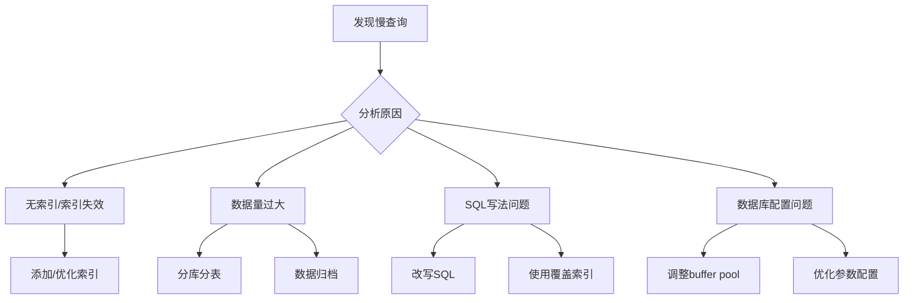

# MySQL数据库设计规范文档

## 一、表设计规范

### 1.1 命名规范

```sql
-- 表名：小写字母+下划线，统一前缀，复数形式
-- 正确示例
user_info, order_detail, product_category

-- 错误示例
UserInfo, orderDetail, tbl_user

-- 字段名：小写字母+下划线
user_id, create_time, is_deleted

-- 主键：统一使用 id
id BIGINT UNSIGNED NOT NULL AUTO_INCREMENT

-- 外键：关联表名_关联字段名
user_id, order_id, category_id
```

### 1.2 字段类型选择原则

| 场景 | 推荐类型 | 原因 |
|------|---------|------|
| 主键ID | `BIGINT UNSIGNED` | 支持大数据量，避免溢出 |
| 用户ID、订单号 | `BIGINT` / `VARCHAR(32)` | 根据是否纯数字选择 |
| 状态字段 | `TINYINT` | 节省空间，范围0-255足够 |
| 时间字段 | `DATETIME` (MySQL 5.6+) | 支持1000-9999年，直观 |
| 小数字 | `DECIMAL(10,2)` | 避免浮点精度问题 |
| 定长字符串 | `CHAR(n)` | 固定长度，如手机号、MD5 |
| 变长字符串 | `VARCHAR(n)` | 节省空间，n根据实际设置 |
| 大文本 | `TEXT` / `LONGTEXT` | 超过5000字符 |
| JSON数据 | `JSON` (MySQL 5.7+) | 支持索引和函数查询 |

### 1.3 必须包含的通用字段

```sql
CREATE TABLE `example` (
    `id` BIGINT UNSIGNED NOT NULL AUTO_INCREMENT COMMENT '主键ID',
    `create_time` DATETIME NOT NULL DEFAULT CURRENT_TIMESTAMP COMMENT '创建时间',
    `update_time` DATETIME NOT NULL DEFAULT CURRENT_TIMESTAMP ON UPDATE CURRENT_TIMESTAMP COMMENT '更新时间',
    `is_deleted` TINYINT NOT NULL DEFAULT 0 COMMENT '逻辑删除：0-未删除，1-已删除',
    `version` INT UNSIGNED NOT NULL DEFAULT 0 COMMENT '乐观锁版本号',
    -- 业务字段 --
    PRIMARY KEY (`id`)
) ENGINE=InnoDB DEFAULT CHARSET=utf8mb4 COLLATE=utf8mb4_unicode_ci COMMENT='示例表';
```

### 1.4 建表规范检查清单

- [ ] 是否指定了存储引擎（InnoDB）
- [ ] 是否设置了字符集（utf8mb4）
- [ ] 是否添加了表注释
- [ ] 每个字段是否有注释
- [ ] 是否设置了合适的默认值
- [ ] 是否避免了NULL字段（尽可能NOT NULL）
- [ ] 是否避免了冗余索引
- [ ] 单表字段数是否不超过50个

---

## 二、索引设计规范

### 2.1 索引命名规范

```sql
-- 主键索引
PRIMARY KEY (`id`)

-- 唯一索引：uk_字段名
UNIQUE KEY `uk_user_name` (`user_name`)

-- 普通索引：idx_字段名
KEY `idx_create_time` (`create_time`)

-- 组合索引：idx_字段1_字段2（按顺序）
KEY `idx_status_create_time` (`status`, `create_time`)

-- 前缀索引：字段名太长时使用
KEY `idx_title_prefix` (`title`(50))
```

### 2.2 索引设计原则

#### 核心原则表

| 原则 | 说明 | 示例 |
|------|------|------|
| **最左前缀** | 组合索引按顺序生效 | `(a,b,c)` 支持 a, ab, abc 查询 |
| **区分度优先** | 高区分度字段放前面 | 状态字段区分度低，不适合放首位 |
| **覆盖索引** | 索引包含所有查询字段 | `SELECT id, name FROM user WHERE id=1` |
| **避免索引运算** | 不在索引列使用函数 | ❌ `WHERE DATE(create_time)=‘2024-01-01’`<br>✅ `WHERE create_time BETWEEN ‘2024-01-01’ AND ‘2024-01-02’` |
| **避免Like前缀通配** | 前缀%会导致索引失效 | ❌ `WHERE name LIKE ‘%张三’`<br>✅ `WHERE name LIKE ‘张三%’` |

### 2.3 索引数量控制

```sql
-- 单表索引数量建议不超过5-7个
-- 组合索引字段数建议不超过5个

-- 索引代价：
-- 1. 占用磁盘空间（约数据量的1%-3%）
-- 2. 降低INSERT/UPDATE/DELETE性能（约30%-50%）
-- 3. 增加查询优化器选择成本
```

### 2.4 必须创建索引的场景

```sql
-- 1. 主键（自动创建）
PRIMARY KEY (`id`)

-- 2. 外键字段
KEY `idx_user_id` (`user_id`)

-- 3. WHERE条件高频字段
KEY `idx_status` (`status`)

-- 4. ORDER BY字段
KEY `idx_create_time` (`create_time`)

-- 5. GROUP BY / DISTINCT字段
KEY `idx_category` (`category`)

-- 6. 多表JOIN的关联字段
KEY `idx_order_id` (`order_id`)
```

### 2.5 索引失效场景（避免）

```sql
-- ❌ 使用 != 或 <>
WHERE status != 1

-- ❌ IS NULL 判断（但 IS NOT NULL 也可能失效）
WHERE deleted_at IS NULL

-- ❌ OR条件（除非所有字段都有索引）
WHERE user_id = 1 OR name = '张三'

-- ❌ 隐式类型转换
WHERE user_id = '123'  -- user_id是INT类型
WHERE phone = 13800138000  -- phone是VARCHAR

-- ❌ 负向查询
NOT IN, NOT EXISTS, <> 等
```

### 2.6 索引设计实战案例

```sql
-- 场景：订单表查询
CREATE TABLE `orders` (
    `id` BIGINT UNSIGNED AUTO_INCREMENT,
    `order_no` VARCHAR(32) NOT NULL COMMENT '订单号',
    `user_id` BIGINT UNSIGNED NOT NULL COMMENT '用户ID',
    `status` TINYINT NOT NULL DEFAULT 0 COMMENT '状态：0待支付，1已支付，2已完成，3已取消',
    `amount` DECIMAL(12,2) NOT NULL COMMENT '金额',
    `pay_time` DATETIME DEFAULT NULL COMMENT '支付时间',
    `create_time` DATETIME NOT NULL DEFAULT CURRENT_TIMESTAMP,
    PRIMARY KEY (`id`),
    UNIQUE KEY `uk_order_no` (`order_no`),  -- 订单号唯一索引
    KEY `idx_user_id` (`user_id`),  -- 用户查询
    KEY `idx_status_create_time` (`status`, `create_time`),  -- 状态+时间组合
    KEY `idx_user_status` (`user_id`, `status`),  -- 用户订单状态查询
    KEY `idx_pay_time` (`pay_time`)  -- 时间范围查询
) ENGINE=InnoDB DEFAULT CHARSET=utf8mb4 COMMENT='订单表';

-- 查询示例：
-- 1. 查询用户未支付订单（使用 idx_user_status）
SELECT * FROM orders WHERE user_id = 100 AND status = 0;

-- 2. 查询待支付且超过30分钟的订单（使用 idx_status_create_time）
SELECT * FROM orders WHERE status = 0 AND create_time < DATE_SUB(NOW(), INTERVAL 30 MINUTE);

-- 3. 根据订单号查询（使用 uk_order_no）
SELECT * FROM orders WHERE order_no = 'ORD202401011234';
```

---

## 三、SQL编写规范

### 3.1 SELECT规范

```sql
-- ✅ 只查询需要的字段
SELECT id, user_name, email FROM users WHERE id = 1;

-- ❌ 避免 SELECT *
SELECT * FROM users WHERE id = 1;

-- ✅ 分页查询使用LIMIT
SELECT * FROM orders WHERE user_id = 1 LIMIT 20;

-- ✅ 大分页优化（延迟关联）
SELECT * FROM orders t1 
INNER JOIN (
    SELECT id FROM orders WHERE status = 1 ORDER BY id LIMIT 100000, 20
) t2 ON t1.id = t2.id;
```

### 3.2 JOIN规范

```sql
-- ✅ 小表驱动大表
SELECT * FROM small_table s 
INNER JOIN big_table b ON s.id = b.small_id;

-- ✅ 关联字段类型一致且有索引
-- 确保两个表的关联字段都有索引且类型相同

-- ❌ 避免超过3个表JOIN
-- 考虑拆分查询或使用冗余字段
```

### 3.3 DML规范

```sql
-- ✅ 批量操作
INSERT INTO users (name, email) VALUES 
    ('张三', 'zhang@example.com'),
    ('李四', 'li@example.com'),
    ('王五', 'wang@example.com');

-- ✅ 分批删除/更新（避免长事务和锁）
DELETE FROM logs WHERE create_time < '2024-01-01' LIMIT 1000;
-- 循环执行直到影响行数为0

-- ✅ 使用ON DUPLICATE KEY UPDATE
INSERT INTO user_count (user_id, count) VALUES (1, 1)
ON DUPLICATE KEY UPDATE count = count + 1;
```

---

## 四、性能优化检查清单

### 4.1 EXPLAIN解读

```sql
EXPLAIN SELECT * FROM users WHERE email = 'test@example.com';

-- 关键指标：
-- type: const > eq_ref > ref > range > index > ALL（至少达到range或ref）
-- possible_keys: 实际使用的索引
-- key_len: 索引使用长度（越小越好）
-- rows: 扫描行数（越小越好）
-- Extra: Using index（覆盖索引，优秀）/ Using filesort（需优化）/ Using temporary（需优化）
```

### 4.2 慢查询优化思路



### 4.3 容量规划

| 数据量级 | 策略 |
|---------|------|
| < 100万 | 常规设计，单表即可 |
| 100万 - 1000万 | 优化索引，考虑分区表 |
| 1000万 - 5000万 | 垂直拆分或分表 |
| > 5000万 | 水平分片（Sharding） |

---

## 五、规范执行工具

### 5.1 自动化检查SQL

```sql
-- 查找缺失索引的表
SELECT 
    t.table_name,
    t.engine,
    t.table_rows
FROM information_schema.tables t
LEFT JOIN information_schema.statistics s 
    ON t.table_name = s.table_name AND t.table_schema = s.table_schema
WHERE t.table_schema = 'your_database'
    AND t.table_type = 'BASE TABLE'
    AND s.index_name IS NULL;
```

### 5.2 推荐工具
- **pt-query-digest**：慢查询分析
- **pt-index-usage**：索引使用分析
- **Sqlyog/ Navicat**：可视化设计
- **阿里云DMS**：企业级规范管理

---

## 六、总结：核心要点

1. **表设计三范式**，适当冗余换效率
2. **索引不是越多越好**，5-7个为佳
3. **最左前缀原则**，高区分度字段优先
4. **避免隐式转换和函数运算**，保持索引有效
5. **覆盖索引**是最优解
6. **定期清理慢查询**，持续优化
7. **所有字段NOT NULL**，除非有特殊原因
8. **字符集统一utf8mb4**，支持emoji

这份规范可直接作为团队开发文档使用，建议配合代码Review和自动化工具强制执行。